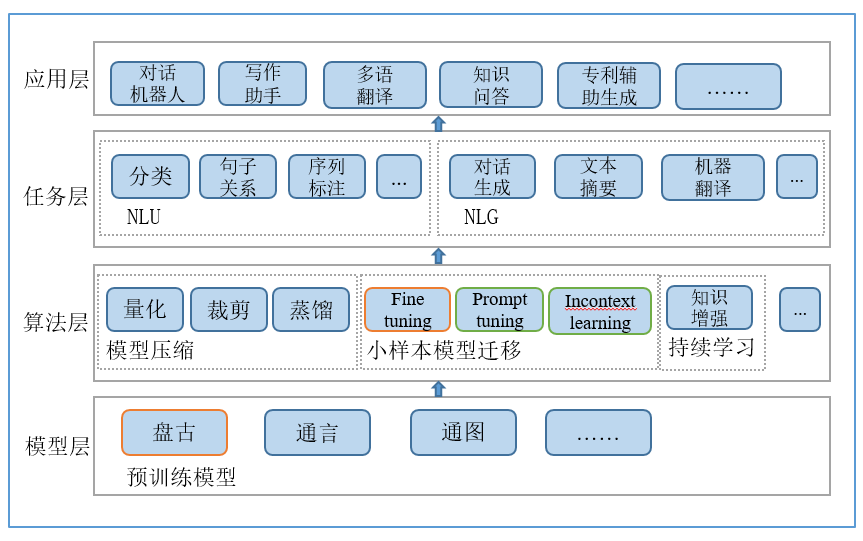

# PanGu-Alpha-Applications
中文|[English](README_EN.md)

## 简介
本项目旨在为鹏程系列超大规模预训练模型提供从算法层到应用层的算法示例和应用示范，以大模型为AI基础设施，加速大模型的应用技术创新和应用生态构建。
目前已提供盘古系列模型的训练推理、finetune\promptune\fewshot learning、模型压缩以及下游任务应用等示例。


## 内容导引
|  | 项目 | 描述 |
| --- | :----------------: | :--------------- |
| 预训练模型 | [[鹏程系列](./model)] | 鹏程系列预训练模型如鹏程.盘古、鹏程.盘古增强版等|
| 算法层&任务层 | [[模型迁移](./method)] <br> [[模型压缩](./method)] |算法层与任务层位置|
| 应用层 | [[应用](./app)]        | 应用层项目位置 |


## 进展
- **2021.08.18** <br>
  * 小样本模型迁移第一版baseline发布。
  * 任务层：支持盘古模型nli任务，baseline：cmnli。
  * 算法层：支持盘古模型fine-tune，prompt-tune，incontext-learning。
- **2021.11.25** <br>
  * 鹏程.盘古增强版beta版发布。
- **2022.01.25** <br>
  * 鹏程.盘古small版版发布。

## 总体框架
**模型层**：基于分布训练模架、大数据、高效算法训练大模型，构建文本、多语言、多模型、知识图谱等领域的AI底层基础设施。<br>
**算法层**：基于预训练模型做模型压缩、小样本模型迁移、持续学习等方面的算法创新，构建基础算法模块，为预训练模型落地应用提供底层算法支撑。<br>
**任务层**：基于算法层基础算法模块，构建两大基础任务NLU和NLG的实现样例，为上层应用提供底层任务建模支撑。<br>
**应用层**：基于任务层基础任务，设计对话机器人、写作助手、多语翻译、知识问答、专利辅助生成等应用，为预训练模型落地应用提供示范应用，促进模型的加速落地和深度应用。

<br/>


## 代码说明
- **代码结构**
```bash
PanGu-Alpha-Application
|-- README.md
|-- app    # 应用层目录
|-- com    # 总共通用目录
|-- megatron    # 引用的megatron代码
|-- method      # 算法层&任务层目录
|-- requirements.txt
`-- resource
```


## License
```bash
正在添加中
```
