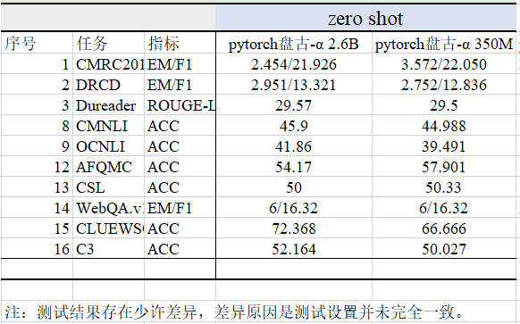

# 鹏程.盘古

## 简介
鹏程.盘古是以鹏城实验室为首的技术团队联合攻关训练出的业界首个2000亿参数以中文为核心的预训练生成语言模型。
支持丰富的场景应用，在知识问答、知识检索、知识推理、阅读理解等文本生成领域表现突出，具备很强的小样本学习能力。


## 详述
### 项目主页
NPU版：[[NPU版](https:\//git.openi.org.cn/PCL-Platform.Intelligence/PanGu-Alpha)]  
GPU版：[[GPU版](https://git.openi.org.cn/PCL-Platform.Intelligence/PanGu-Alpha-GPU)]

### 模型配置
| 模型 | 参数规模 | 结构 | num-layers | hidden-size | ffn-size | heads |
| ------ | ------- | ------ | ------ | ------ | ------ | ------ |
| 鹏程.盘古 200B | 200B | Transformer decoder | 64 | 16384 | 65536 | 128 |
| 鹏程.盘古 13B  | 13B  | Transformer decoder | 40 | 5120 | 20480 | 40 |
| 鹏程.盘古 2.6B | 2.6B | Transformer decoder | 32 | 2560 | 10240 | 32 |
| 鹏程.盘古 small| 350M | Transformer decoder | 24 | 1024 | 4096 | 16 |


## 示例-pytorch版
### 模型下载
| 参数 | 平台 | 模型文件 | 大小 |
| ------ | ------- | ------ | ---- |
| 350M   | pytorch | [pangu-alpha_350m_fp16.zip](https://git.openi.org.cn/attachments/6e516012-18be-4576-a54e-570218bb3dbd) | 600M |

**注：pytorch版的`num-layers` 要设为实 `num-layers - 1`**

### 推理
```bash
bash scripts/generate_pangu.sh
```

### 模型迁移：finetune\promptune\fewshot learning
请参考模型迁移目录[[模型迁移](../../method)]

### 性能
对于每个任务，如果能获取到测试集则在测试集上进行评估，否则在验证集上进行评估。
同时为了降低计算资源消耗，部分任务上从数据中随机采样部分子集进行评估。
盘古2.6B和盘古small的pytorch的zero shot测试结果如下表。

<br/>
注：测试结果与mindspore版存在少许差异，差异原因是测试设置并未完全一致。


## 示例-mindspore版
请参考鹏程.盘古项目主页[[Pangu](https:\//git.openi.org.cn/PCL-Platform.Intelligence/PanGu-Alpha)]。


## 环境
### pytorch版
支持 python >= 3.6, pytorch >= 1.5, cuda >= 10, nccl >= 2.6, and nltk。
推荐使用英伟达的官方 docker 镜像`docker pull nvcr.io/nvidia/pytorch:20.03-py3`。

### mindspore版
请参考鹏程.盘古项目主页[[Pangu](https:\//git.openi.org.cn/PCL-Platform.Intelligence/PanGu-Alpha)]。
