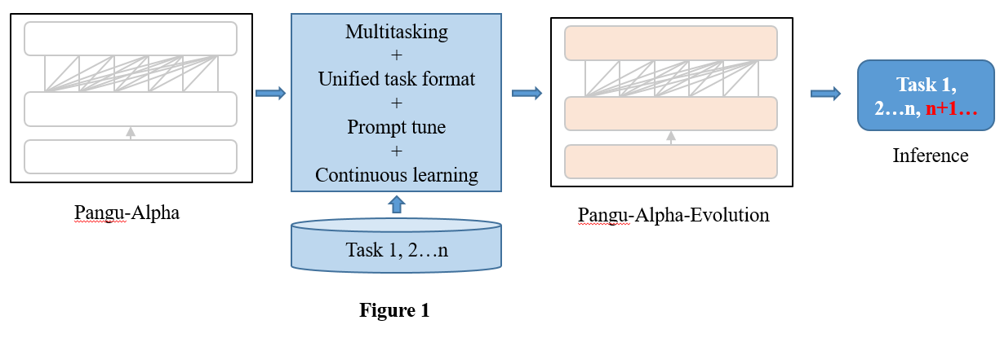
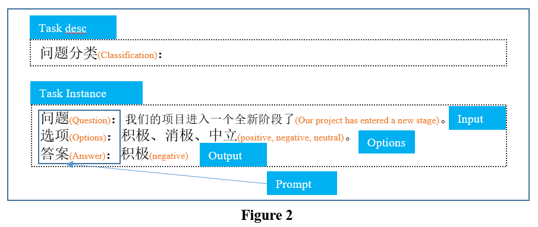

# 鹏程.盘古增强版

中文|[English](README_EN.md)

## 简介
盘古增强版，更强的任务理解与处理能力，更加擅长遵循您的任务说明。更多技术细节会持续更新，敬请关注。
目前盘古增强版2.6B GPU版本的模型推理阶段显存占用控制在7G以内，8G显存的机器即可推理。

**要点：**
- 创新应用了多任务学习、任务统一格式、提示微调和持续学习技术，对基本版模型进行了能力扩展和增强，性能得到大幅提升。
- 提供了基于盘古大模型进行提示微调和持续学习的性能优化新范式，更好的识别用户的任务说明，同时做到尽量保持模型的原始生成能力。
- 盘古增强版，参数量2.6B，在中英翻译、开放域知识问答、文本分类、摘要生成等能力提升显著，在一张V100 GPU卡上可以完成多路并行推理。


## 方法
### 基本方案
图1显示了用于构建增强模型的主要方法。我们采用了四种技术方法来提高模型的任务理解和处理能力，以及对任务描述的泛化能力。即多任务、统一任务格式、快速调整和持续学习。

<br/>

### 统一任务格式
我们设计了统一的任务格式，如图2所示。该统一格式旨在减少下游任务之间的差异，提高知识转移和任务描述的泛化能力。使用这种格式，我们在18个任务上构建了50多个提示，以训练盘古增强版模型。

<br/>

## Performances
我们进行了大量实验来比较盘古增强版和盘古在自然语言理解任务和自然语言生成任务中的表现。这些任务的结果见表1。对于每个任务，如果能获取到测试集则在测试集上进行评估，否则在验证集上进行评估。同时为了降低计算资源消耗，部分任务上从数据中随机采样部分子集进行评估。结果表明，盘古增强版的各项任务的性能远远优于盘古，平均提高1000%以上。虽然盘古增强版模型只训练了5/6个epoch，但它仍在训练中。同时，通过人工评估，我们得出结论，它保持了与盘古模型相同的原始生成能力。

<br/>


## 模型文件
| 模型文件 | Md5 | 大小 | 参数配置 |
| ------ | ---- | ---- | -------- |
| [pangu-alpha-evolution_2.6B_fp16 .zip](https://git.openi.org.cn/PCL-Platform.Intelligence/PanGu-Alpha-Applications/datasets?type=0) | e5c8cbb713fd916b12cbed7fb94a1242 | 4.6G | num-layers : 31<br />hidden-size : 2560<br />num-attention-heads : 32 |

```txt
pangu-alpha-evolution_2.6B_fp16                 # 模型目录
    -- iter_0001000                             # 迭代次数目录
        --mp_rank_00                            # 模型并行时各个 GPU 的目录
            --model_optim_rng.pt                # 模型文件
    --latest_checkpointed_iteration.txt         # 记录 ckpt 的迭代次数文件
```

**注：`num-layers` 等于 [Pangu](https://git.openi.org.cn/PCL-Platform.Intelligence/PanGu-Alpha) 项目中的 `num-layers - 1`**


## 示例
### 推理代码
```bash
bash scripts/generate_pangu_evolution.sh
```

### 示例输入
了解如何为常用用例创建提示。

NLI
```bash
Input:
推理关系判断：
前提：新的权利已经足够好了
假设：每个人都很喜欢最新的福利
选项：矛盾，蕴含，中立
答案：

Model output:
中立
```

Classification
```bash
Input:
文本分类：
基本上可以说是诈骗
选项：积极，消极
答案：

Model output:
消极
```

QA
```bash
Input:
问题：郑州是那个省的
答案：

Model output:
河南
```

Translate
```bash
Input:
翻译成英文：
不过他承认，美国与欧洲关系密切。

Model output:
He admitted that the United States was relatively friendly with Europe.
```


## 环境
### pytorch版
支持 python >= 3.6, pytorch >= 1.5, cuda >= 10, nccl >= 2.6, and nltk。
推荐使用英伟达的官方 docker 镜像`docker pull nvcr.io/nvidia/pytorch:20.03-py3`。
