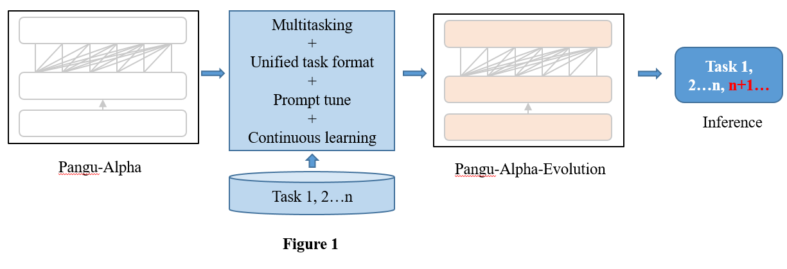
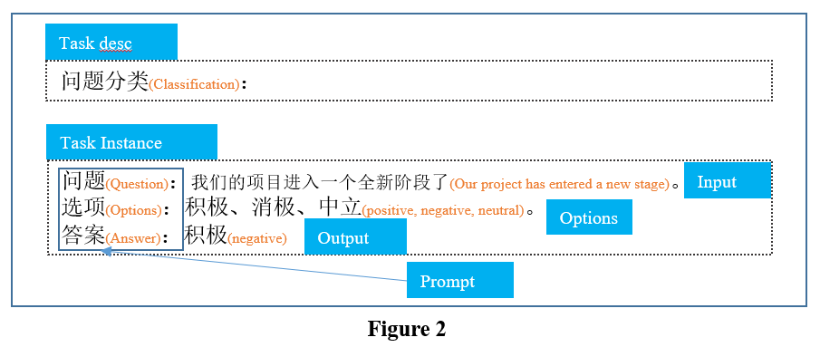
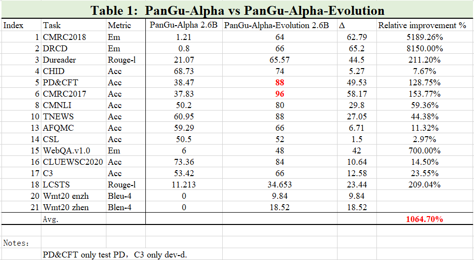

# PanGu-Alpha-Evolution

[中文](README.md)|English

## Introduction
PanGu-Alpha-Evolution is an enhanced version of Pangu-Alpha, which can better understand and process tasks, and better follow your task description. More technical details will be updated continuously, please pay attention.

## Methods
### Scheme
The illustration of the main methods used to build the enhanced model is shown in Figure 1. We adopted four technical methods to improve the model's task understanding and processing capabilities, as well as the generalization capabilities of task descriptions. That is multitasking, unified task format, prompt tune and continuous learning.

<br/>

### Unified task format
We designed the unified task format shown in Figure 2. The unified format is designed to reduce the differences between downstream tasks and promote the ability of knowledge transfer and task description generalization. Using this format, we built more than 50 prompts on 18 tasks to train the PanGu-Alpha-Evolution model.
<br/>

## Performances
We conducted extensive experiments to compare the performance of PanGu-Alpha-Evolution and PanGu-Alpha on both natural language understanding tasks and natural language generation tasks. The results of those tasks are reported in Table 1. The results show that the performance of each task of PanGu-Alpha-Evolution is far superior to PanGu-Alpha, and the average improvement is more than 1000%. Although the PanGu-Alpha-Evolution Model has only been trained for 5/6 epochs, it is still training. Meanwhile, through manual evaluation, we conclude that it maintains the same original generation ability as the PanGu-Alpha model.

<br/>

## Model files
| Model file | Md5 | Size | Config |
| ------ | ---- | ---- | -------- |
| [pangu-alpha-evolution_2.6B_fp16 .zip](https://git.openi.org.cn/PCL-Platform.Intelligence/PanGu-Alpha-Applications/datasets?type=0) | e5c8cbb713fd916b12cbed7fb94a1242 | 4.6G | num-layers : 31<br />hidden-size : 2560<br />num-attention-heads : 32 |

```txt
pangu-alpha-evolution_2.6B_fp16                 
    -- iter_0001000                             
        --mp_rank_00                            
            --model_optim_rng.pt                
    --latest_checkpointed_iteration.txt         
```

**notes：`num-layers` equals `num-layers - 1` in project [Pangu](https://git.openi.org.cn/PCL-Platform.Intelligence/PanGu-Alpha).**

## Examples
### Inference
Inference code.
```bash
bash scripts/generate_pangu_evolution.sh
```

### Use cases
Learn how to create prompts for popular use cases.

NLI
```bash
Input:
推理关系判断：
前提：新的权利已经足够好了
假设：每个人都很喜欢最新的福利
选项：矛盾，蕴含，中立
答案：

Model output:
中立
```

Classification
```bash
Input:
文本分类：
基本上可以说是诈骗
选项：积极，消极
答案：

Model output:
消极
```

QA
```bash
Input:
问题：郑州是那个省的
答案：

Model output:
河南
```

Translate
```bash
Input:
翻译成英文：
不过他承认，美国与欧洲关系密切。

Model output:
He admitted that the United States was relatively friendly with Europe.
```

## Environment
### Pytorch version
python >= 3.6, pytorch >= 1.5, cuda >= 10, nccl >= 2.6, and nltk.
We recommend using NVIDIA's official docker image `docker pull nvcr.io/nvidia/pytorch:20.03-py3`.
